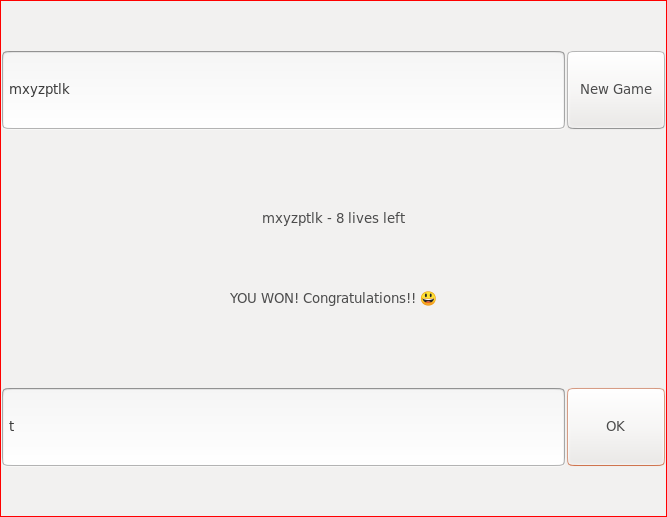

# Hangman.jl
Hangman game with a Mealy machine in Julia.

This project illustrates how to implement a Mealy machine, following the same idea from [this inspiring talk](https://www.youtube.com/watch?v=WGT9_cEImAk) by Joshua Ballanco from JuliaCon2019.

We implement the game of "Hangman" as a Mealy machine, in a completely abstract way, and then create a GUI with Gtk.jl on top of this Hangman.jl module. The GUI code sends input objects to the machine, and handles the output objects coming out of it. The business logic from the game is completely separate from the interface.

Tests show how to produce a list of outputs and states given a list of inputs, something that can be very handy to test complex applications.
